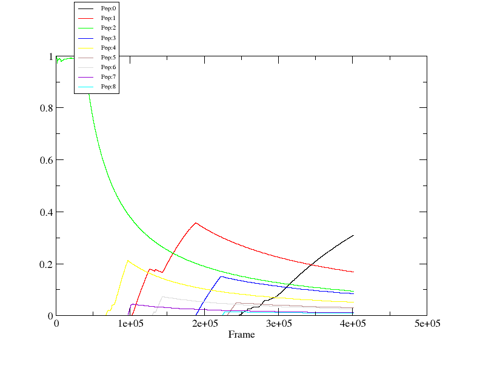

# MD_analysis_cpptraj
How to analyze MD trajectories using CPPTRAJ

## Prerequsitories
필요한 것:
Amber 프로그램 suite - 그 중에서 이 tutorial 에서는 cpptraj 프로그램을 사용하는 법을 다룰 예정입니다. 

LCBC 학생들은 master의 /opt/amber18/에 설치되어 있는 Amber를 사용하면 됩니다. 
MD trajectory files. (*.nc or *.mdcrd)
Parameter files. (*.prmtop)

## About cpptraj input script
아래에 있는 script는 cpptraj 프로그램을 이용해서 MD trajectory에서 RMSD, hydrogen-bond, 그리고 lifetime 분석을 수행하는 script입니다.
전체 파일은 같은 repository에 업로드 되어 있습니다.  

본 script를 하나씩 따라가면서 어떻게 분석이 수행되는지 살펴봅시다.
*rmsd_and_hbond_analysis.in*

### parameter 파일 지정하기 
parm 명령어를 이용해서 일단 parameter 파일을 지정해줍니다. 

```
# Set up parameter & topology files.
parm msdx-rf-l1-solv.prmtop
```

### Trajectory 파일 지정하기
그 뒤에 trajin 명령을 이용해서 분석하고자 하는 대상 trajectory 파일을 지정해줍니다. 
```
trajin step5_100.nc 1 last 1
trajin step5_101.nc 1 last 1
trajin step5_102.nc 1 last 1
...
```

위의 예시에서는 세개의 파일만 저정하였지만 실제로 내가 가진 trajectory파일이 더 많다면 차례대로 다음 줄에 지정해주면 됩니다.
그리고 각 trajectory파일 뒤에 있는 option은 **첫번째 숫자는 시작하는 frame**, **두 번째는 끝나는 frame을 지정하는 부분인데 숫자 또는 *last* 를 줄 수 있습니다.**
**세번째 숫자는 *offset*에 해당하는 숫자로 몇 frame씩 뛰어 넘어서 분석할지를 지정해줍니다.**
현재 위의 예제에서는 모든 frame을 분석하도록 지정하였습니다.

만약, 내가 모든 frame을 분석하는데 시간이 너무 많이 걸리거나 메모리가 모자라서 일부분의 데이터만 쓰고 싶다면, 다음과 같이 변형시켜 줍시다.
아래 예제의 script는 매 10 번째 frame을 분석합니다. 즉, 전체 데이터의 10%만 사용해서 분석하게 되는 것입니다. 

```
trajin step5_100.nc 1 last 10
trajin step5_101.nc 1 last 10
trajin step5_102.nc 1 last 10
...
```

### Centering atoms 
일반적으로 MD simulation을 수행하면 periodic boundary condition 때문에 residue가 이상하게 위치하고 있는 경우가 많습니다.

이럴 때, autoimage는 trajectory를 보기 좋게 다시 정렬해주는 명령어입니다. 
```
autoimage
```

### RMSD 계산
RMSD 는 Root Mean Squared Deviation의 줄임말로써, 평균적으로 분자를 이루고 있는 원자들이 기준이 되는 구조와 비교하였을 때, 몇 A정도 변화하였는지를 나타내는 값입니다. 
아래는 cpptraj에서 RMSD를 계산하는 명령어입니다. 

```
rms ToFirstHeavy :1-148&!@H=    first out ToFirst_heavy.rms.txt mass
```

첫번째, rms 명령어는 rmsd 계산을 수행하겠다는 뜻입니다. 
두번째인 ToFirstHeavy는 계산된 rmsd 값이 들어있는 dataset 의 이름을 의미합니다. 이 데이터셋은 나중에 다른 계산을 위해서 불러올 수 있기 때문에 이름을 지정해주게 됩니다.

그 뒤에 어떤 atom을 이용해서 RMSD를 계산해줄지 지정해 주게 됩니다. :1-148은 1번에서 148번까지 residue를 이용하겠다는 뜻입니다. 그 뒤에 있는 !@H=은 이름이 H로 시작하는 모든 atom (@H=)이 아닌 atom들 (!이 not의 의미를 가집니다.), 다시 말해서 모든 heavy atom을 고려하겠다는 뜻입니다. 이 두가지가 and로 결합되어 있다고 생각하면 결국, 1번에서 148번 residue에 포함되어 있는 모든 heavy atom을 이용해서 RMSD를 계산하겠다는 뜻입니다. 

네 번째에 있는 *first* option은 첫번째 frame을 기준으로 RMSD를 계산하겠다는 뜻입니다. 

다섯번째 *out* option 다음에는 RMSD 값을 출력하는 결과 파일의 이름이 오게 됩니다. 

마지막의 mass는 rmsd를 계산할 때, atomic mass를 고려해서 계산하겠다는 뜻입니다. 무거운 원소의 변화가 RMSD 계산에서 더 많이 반영되도록 하는 것입니다.

만약, backbone에 있는 atom만의 rmsd를 계산하겠다면 다음과 같은 line을 사용하면 됩니다. 

```
rms  ToFirstBB  :1-148&@C,CA,N  first  out  ToFirst_backbone.rms.txt  mass
```

### Hydrogen bond analysis

단백질을 비롯한 biological molecule의 경우 수소 결합이 그 구조와 기능을 조절하는데 중요한 역할을 한다는 것이 잘 알려져있습니다.
그렇기 때문에 어떠한 수소결합이 얼마나 많이 생성되는지를 분석하는 것은 매우 의미있는 분석 방법입니다.
Cpptraj에서는 매우 강력한 수소 결합 분석 기능을 제공합니다. 
다음 예제는 수소 결합 계산을 수행하는 예시입니다. 

```
hbond  HB    out HB.hbvtime.dat \
       solventdonor :WAT solventacceptor :WAT@O \
       avgout    HB.UU.avg.dat \
       solvout   HB.UV.avg.dat \
       bridgeout HB.bridge.avg.dat \
       series uuseries uuhbonds.agr uvseries uvhbonds.agr 
```

위 예제에서 hbond 명령은 수소 결합을 수행하겠다는 뜻입니다. 그 뒤에 따라오는 HB는 수소 결합 분석 결과가 저장되는 데이터셋의 이름이 됩니다. 
HB 데이터셋에 저장된 내용은 추후에 추가적인 계산에 사용될 수 있습니다. 

*out* option 다음에 output 파일의 이름을 써줍니다.
하지만 raw 파일인 *HB.hbvtime.dat* 파일은 일반적으로 파일의 크기도 크고, 대부분의 내용이 atom number로만 표시되어 한 눈에 알아보기가 힘듭니다. 
그렇기 때문에 그 뒤에 추가적인 option이 주어지게 됩니다.

solventdonor와 solventacceptor는 각각 solvent에 존재하는 수소 결합 주개와 받개를 지정해주게 됩니다. 물이 아닌 다른 유기 용매가 사용되었다면 그에 맞게 수정이 필요합니다. 이번 예제에서는 solvent가 물이기 때문에 위와 같이 주어졌습니다. 

#### average solute-solute hydrogen bond analysis
그 뒤에 따라오는 *avgout* 옵션은 solute안에서 생성되는 수소 결합 (solute-solute hydrogen bond) 의 평균 값을 표시하게 됩니다.
예시 결과는 다음과 같습니다. 
```
#Acceptor                DonorH           Donor   Frames         Frac      AvgDist       AvgAng
DA_12@OP1            THR_94@HG1      THR_94@OG1   390506       0.9738       2.6692     164.5806
LEU_63@O             THR_67@HG1      THR_67@OG1   371313       0.9260       2.7405     164.8568
DC_26@O2               DG_9@H21         DG_9@N2   369902       0.9224       2.8203     164.9798
DC_7@O2               DG_28@H21        DG_28@N2   358849       0.8949       2.8292     163.8071
DC_33@O2               DG_2@H21         DG_2@N2   357010       0.8903       2.8288     163.9903
DC_20@O2              DG_15@H21        DG_15@N2   355666       0.8869       2.8313     163.5028
DC_30@O2               DG_5@H21         DG_5@N2   352488       0.8790       2.8316     163.2947
DC_3@O2               DG_32@H21        DG_32@N2   341450       0.8515       2.8394     162.8517
DC_16@O2              DG_19@H21        DG_19@N2   339254       0.8460       2.8387     163.4302
```

위의 결과는 DNA와 단백질이 결합되어 있는 system의 계산 결과를 보여주고 있습니다. 
첫번째 줄을 살펴보면, 12번 DA(adenosine) residue의 OP1 atom과 94번 THR residue의 HG1 atom이 수소결합을 이루고 있다는 것을 표시합니다. 
Donor는 Thr의 HG1 atom이 붙어 있는 heavy atom을 표시합니다.

그 뒤에 있는 Frame 열은 전체 trajectory에서 몇 번의 frame 에서 해당하는 수소 결합이 관찰되었는지를 보여줍니다. 
위 예제에서는 약 39만번의 snapshot에서 수소 결합이 관찰되었다는 것을 나타냅니다.

Frac열은 전체 trajectory중에서 해당 수소 결합이 관찰된 fraction을 나타냅니다. 
전체 trajectory에서 약 97%이상에서 첫번째 line에 해당하는 수소 결합이 관찰된다는 뜻입니다. 
참고로, 위 예제에서 전체 trajectory의 frame 개수는 약 40만개 입니다. 
그러므로 simulation이 진행되는 거의 대부분의 시간 동안 첫번째 수소 결합은 유지되고 있다는 것을 알 수 있습니다. 

마지막 2열은 평균 수소 결합의 길이와 각도를 보여주고 있습니다. 

#### average solute-solvent hydrogen bond analysis
위의 분석과 비슷하게 *solvout* option 뒤에는 solute와 solvent 사이에 형성되는 수소 결합의 분석 결과를 보여줍니다. 
```
#Solute-Solvent Hbonds:
#Acceptor                DonorH           Donor    Count         Frac      AvgDist       AvgAng
DT_13@OP2              SolventH      SolventDnr  1008589       2.5152       2.7282     161.7765
DA_31@OP2              SolventH      SolventDnr  1008408       2.5147       2.7261     161.8580
DC_26@OP2              SolventH      SolventDnr  1003021       2.5013       2.7276     161.6394
DC_33@OP2              SolventH      SolventDnr  1002656       2.5004       2.7264     161.8224
DG_32@OP2              SolventH      SolventDnr  1002198       2.4992       2.7279     161.7294
DA_25@OP2              SolventH      SolventDnr  1000667       2.4954       2.7284     161.7174
LYS_146@OXT            SolventH      SolventDnr  1000629       2.4953       2.7088     162.4099
DT_14@OP2              SolventH      SolventDnr  1000571       2.4952       2.7276     161.7065
```

위의 결과에서 fraction이 1보다 큰 값이 나오는 이유는 2개 이상의 water molecule이 acceptor에 결합할 수 있기 때문입니다. 

#### average salt bridge(염다리) 
[salt bridge](https://en.wikipedia.org/wiki/Salt_bridge_(protein_and_supramolecular))는 이온결합과 수소결합이 동시에 나타나는 형태를 뜻합니다. 
***bridgeout*** option 뒤에 salt bridge 분석 결과가 출력될 파일의 이름을 써줍니다.
제대로 계산이 되었다면 bridgeout 파일에는 다음과 같은 내용이 출력되게 됩니다. 
```
#Bridging Solute Residues:
Bridge Res 11:DA   139:ASN , 236365 frames.
Bridge Res 27:DT   93:ARG , 215152 frames.
Bridge Res 10:DT   24:DT  , 179050 frames.
Bridge Res 12:DA   24:DT  , 166091 frames.
Bridge Res 13:DT   139:ASN , 156346 frames.
Bridge Res 13:DT   23:DT  , 150718 frames.
Bridge Res 14:DT   15:DG  , 140311 frames.
Bridge Res 27:DT   84:ARG , 136692 frames.
Bridge Res 25:DA   26:DC  , 133495 frames.
```
어떤 residue들이 얼마나 자주 salt bridge를 형성하는지 알 수 있습니다. 

### Timeseries plot 
수소결합 분석의 마지막줄에 있는 다음 명령어는 각 수소결합이 언제 형성되고 사라지는지를 표시해주는 파일을 생성합니다.

```
series uuseries uuhbonds.agr uvseries uvhbonds.agr
```

확장자가 **.agr**인 파일은 xmgrace라는 그래프 그려주는 프로그램의 input파일을 뜻합니다.

이 때 생성되는 그래프의 *X축은 frame number, Y축은 수소결합이 형성되었으면 1, 그렇지 않으면 0으로 표현됩니다.*

우분투에서 xmgrace가 설치되어 있지 않다면 apt으로 다음과 같이 간단히 설치할 수 있습니다. 

```console
foo@master:~$ sudo apt install xmgrace
```
그 후에 다음 명령으로 그래프를 확인할 수 있습니다. 

```console
foo@master:~$ xmgrace uuhbonds.agr
```

### Print out Timeseries

예시 input 파일에서 hbond 명령어 밑에 다음과 같은 명령어가 존재합니다. 
아래 명령어는 **시간에 따른 수소결합 개수의 변화**를 **nhbvtime.agr**이라는 파일에 저장하겠다는 뜻입니다. 
그 뒤 *run*이라는 명령어를 만났을 때, cpptraj는 실제로 수소 결합 분석을 수행하게 됩니다. 


```
create nhbvtime.agr  HB[UU]  HB[UV]  HB[Bridge]
run
```

앞에서 hbond 명령어에서 수소 결합의 결과를 **HB**라는 이름의 데이터셋으로 저장하였습니다. 
이렇게 저장을 하면 cpptraj는 *자동으로* **HB[UU], HB[UV], HB[Bridge]** 라는 데이터셋을 내부적으로 생성하게 됩니다. 
HB[UU]는 solute-solute 수소 결합의 개수, HB[UV]는 solute-solvent 수소 결합의 개수, HB[Bridge]는 염다리의 개수를 의미합니다.
Frame에 따라 각 수소 결합의 총 개수를 nhbvtime.agr이라는 파일에 저장하게 됩니다. 

### Lifetime analysis
수소 결합 분석이 끝난 후, 수소 결합 분석 결과를 바탕으로 lifetime analysis를 수행할 수 있습니다. 

Lifetime analysis는 각 수소결합이 **얼마나 오래 유지되는지**를 알려줍니다. 

만일 어떤 수소 결합이 다음과 같은 패턴으로 형성되었다고 합시다. 
{1 1 1 1 0 0 1 1 0 0 0 1 }

그렇다면 위의 수소 결합 형성 패턴은 다음과 같다고 볼 수 있습니다. 
Lifetime이 4인 결합이 1번, lifetime이 2인 결합이 1번, lifetime이 1인 결합이 1번 이렇게 총 3번 형성되었다고 볼 수 있습니다. 
즉, 다시 말해서 평균 lifetime은 (4 + 2 + 1) / 3 = 2.333, Max lifetime은 4 라고 볼 수 있습니다. 
이와 같이 특정 수소 결합이 형성되면 평균적으로 얼마만큼 유지가 되는지를 계산해주는 명령입니다. 

Lifetime 분석 명령은 다음과 같습니다. 

```
lifetime HB[solutehb]  out HB.solutehb.lifetime.dat
runanalysis
```

위 명령에서 HB[solutehb]는 solute-solute 수소 결합의 정보를 가지고 있는 데이터셋입니다. 
앞선 예제와 비슷하게 hbond의 데이터셋 이름을 HB로 지정하면, cpptraj 내부적으로 HB[solutehb] 라는 데이터셋이 자동으로 생성됩니다.

*out* option 다음에는 결과 파일의 이름을 써줍니다. 

그리고 *runanalysis* 라는 명령을 만나면 실제로 lifetime 명령이 실행되게 됩니다.

Lifetime analysis가 제대로 되었다면 다음과 같은 결과를 볼 수 있습니다. 
```
#Set     lifetime_04302 lifetime_04302[max] lifetime_04302[avg] lifetime_04302[frames]         lifetime_04302[name]
       1              8                   1              1.0000                      8     DA5_1@O4'-DA5_1@O5'-HO5'
       2          65104                  62              4.6607                 303428      DA5_1@N3-DA5_1@O5'-HO5'
       3              5                   2              1.2000                      6     DA5_1@O3'-DA5_1@O5'-HO5'
       4             24                  48              8.7500                    210      DG_2@OP1-DA5_1@O5'-HO5'
       5             26                  14              4.1923                    109      DG_2@OP2-DA5_1@O5'-HO5'
       6              6                   5              2.6667                     16      DG_2@O4'-DA5_1@O5'-HO5'
       7              2                   1              1.0000                      2       DG_2@N3-DA5_1@O5'-HO5'
       8              4                   1              1.0000                      4     DT3_34@O4-DA5_1@O5'-HO5'
       9            103                  27              3.0485                    314     DT3_34@O2-DA5_1@O5'-HO5'
```
각 수소 결합의 max lifetime ([max]), average lifetime ([avg])를 확인할 수 있습니다. 


## Clustering analysis
[Clustering analysis](https://en.wikipedia.org/wiki/Cluster_analysis)는 Trajectory안에 있는 다양한 구조들을 바탕으로 **유사한 구조들끼리 그룹으로 묶어주는** 분석을 수행합니다. 

아래 cpptraj input에서 #으로 시작되는 부분은 모두 주석 부분입니다. 
본문에서는 주석 내용을 조금 더 풀어서 자세히 설명하고자 합니다. 
실제로 사용된 clustering 분석을 위한 cpptraj input file은 repository에 들어있는 clustering.in 파일을 참고하세요. 

```
# STRIP IONS
strip :WAT,Na+,Cl- outprefix no_solvent

# Cluster analysis command:
#  C0: Cluster output data set(s) name.
# CLUSTERING OPTIONS:
#  dbscan: Use the DBSCAN (density based) clustering algorithm.
#    minpoints: Minimum # of points to form a cluster.
#    epsilon: Distance cutoff for forming cluster.
#    sievetoframe: Restore sieved frames by comparing to all cluster frames,
#                  not just centroid.
# DISTANCE METRIC OPTIONS:
#  rms <mask>: Use RMSD of atoms in <mask> as distance metric.
#  sieve 10  : Use <total> / 10 initial frames for clustering.
# OUTPUT OPTIONS:
#  out <file>: Write cluster number versus time to file.
#  summary <file>: Write overall clustering summary to file.
#  info <file>: Write detailed cluster results (including DBI, pSF etc) to file.
#  cpopvtime <file> normframe: Write cluster population vs time to <file>,
#                              normalized by # frames.
# COORDINATE OUTPUT OPTIONS:
#  repout <file prefix> repfmt pdb: Write cluster representatives to files with
#                                   PDB format.
#  singlerepout <file> singlerepfmt netcdf: Write cluster representatives to
#                                           single file with NetCDF format.
#  avgout <file> avgfmt restart: Write average over all frames in each cluster
#                                to separate files with Amber restart file
#                                format.

cluster C0  dbscan minpoints 50 epsilon 2.0 rms :1-148&!@H=  \ 
            sieve 50 random sievetoframe \ 
	    summary heavy_eps_2.0_cluster_summary.dat \
	    out heavy_eps_2.0_cluster_cnumvtime.dat   \
            sil Sil    \
            info heavy_eps_2.0_cluster_info.dat \
            cpopvtime heavy_eps_2.0_cluster_popv_time.agr normframe      \
            repout rep repfmt pdb \
            singlerepout heavy_eps_2.0_singlerep.nc singlerepfmt netcdf  \
            avgout Avg avgfmt restart
```

위에 있는 cpptraj 명령을 찬찬히 살펴봅시다. 
자세한 내용은 [cpptraj manual](https://amber-md.github.io/cpptraj/CPPTRAJ.xhtml)을 참고하세요.

***cluster*** 명령은 clustering 분석을 수행하겠다는 뜻입니다. 
cluster 명령 뒤에 나오는 C0는 데이터셋의 이름을 뜻합니다. 앞에서 했던 수소결합 분석과 유사하게 클러스터링 결과로 나오는 수치적인 데이터들이 C0라는 이름의 데이터셋이 모두 저장되게 됩니다. 

그 뒤에 오는 *dbscan* keyword는 [DBSCAN](https://bcho.tistory.com/1205) 이라는 잘 알려진 *밀도기반* 클러스터링 알고리즘을 사용하겠다는 뜻입니다. 
DBSCAN 이외에도 다른 몇 가지 clustering 방식들이 존재하기 때문에 필요에 따라서 선택해서 사용하면 됩니다 (kmeans, hierarchical agglomerative (bottom-up) approach, density peaks algorithm). 
일반적으로 DBSCAN은 많은 경우 잘 작동하는 것으로 알려져있기 때문에 여기에서는 dbscan을 사용하겠습니다. 

dbscan 뒤에 오는 *minpoints*와 *epsilon* 옵션은 DBSCAN을 수행할 때 필요한 option입니다. 
***minpoints N***은 *N*개 이상의 데이터가 모였을 때, 하나의 클러스터로 간주하겠다는 뜻입니다. 
***epsilon <dist>***은 *<dist>*로 정의된 거리 보다 짧은 거리 안에 존재하는 데이터를 하나의 클러스터로 묶어준다는 뜻입니다. 

**즉, epsilon 값이 작으면 작을 수록 클러스터의 개수는 많아지고, epsilon값이 크면 클러스터의 개수는 적어지게 됩니다.**
DBSCAN의 가장 큰 특징은 클러스트의 개수를 사용자가 미리 정하지 않고, 알고리즘에 의해서 결정된다는 것입니다. 

***rms*** option은 구조들 사이의 거리를 계산할 때, rms keyword 뒤에 정의되어 있는 *mask*를 이용해서 atomic rmsd 값을 계산하겠다는 뜻입니다. 
즉, 이 예제에서는 1번에서 148번 residue에 있는 heavy atom을 이용해서 구조 사이의 거리를 계산하겠다는 뜻입니다. 

***sieve 50 random*** option은 클러스터링에 걸리는 시간을 줄이기 위한 option입니다.
*sieve*라는 단어는 *'체로 거르다'* 라는 뜻입니다. 
클러스터링 계산 수행시, 가장 시간이 많이 걸리는 부분은 구조들 사이의 거리를 계산하는 부분입니다. 
만일 내가 가진 Trajectory가 약 10만개의 구조를 가지고 있다면 그 구조들 사이의 거리를 모두 계산하려면 약 50억번의 계산이 필요합니다. 
무척 시간이 많이 걸리는 계산이 될 것입니다. 
이를 줄이기 위해서 초기 클러스터링 단계에서는 전체 구조를 다 사용하는 대신에 일부분만 사용해서 계산 시간을 줄여줄 수 있습니다. 
이 예제에서는 전체에서 약 1/50에 해당하는 구조만 사용해서 초기 클러스터링을 수행하게 됩니다. 
*random* keyword는 1/50개의 구조를 random하게 뽑겠다는 뜻입니다. 
***sievetoframe*** option은 초기 클러스터링을 위해서 처음에 체로 걸리진 구조를 나중에 클러스터링이 완성된 후에 다시 분류하겠다는 뜻 입니다. 

***summary*** keyword 다음에는 summary file의 이름을 지정해줍니다. 
summary file에는 클러스터가 몇 개인지, 각 클러스터 사이즈는 어느 정도인지등을 요약해서 보여주게 됩니다. 

***out*** keyword 다음에 오는 output 파일에는 각 frame이 어떤 클러스터에 해당하는지를 보여줍니다. 
즉 X축은 frame number, Y축은 cluster index에 해당하는 정보가 들어있게 됩니다. 
이 때, DBSCAN의 경우, noise의 개념이 있어서, 어떤 클러스터에도 해당하지 않는 데이터 포인트, noise에 해당하는 구조는 "-1"의 값을 가지게 됩니다. 

***info*** keyword에 해당하는 keyword 파일은 클러스터의 자세한 정보를 담고 있습니다. 

***cpopvtime*** keyword에 해당하는 파일은 시간에 따라서 각 클러스터의 **누적 크기**를 보여주는 데이터를 저장합니다. 
그 뒤에 나오는 *normframe*의 keyword는 누적된 cluster의 크기를 전체 frame 개수로 나누어 정규화 시켜줍니다. 
cpopvtime 옵션의 결과 파일에 해당하는 **heavy_eps_2.0_cluster_popv_time.agr** 파일은 [***xmgrace***](http://exciting-code.org/xmgrace-quickstart) 라고하는 그래프 생성 프로그램의 input 파일입니다. 

```
xmgrace heavy_eps_2.0_cluster_popv_time.agr
```
과 같이 실행시키면 xmgrace에서 다음과 같은 그림 파일을 생성합니다. 


위 그림에서 보면 초반에는 cluster2에 해당하는 구조가 많이 sampling이 되다가 시간이 지날 수록 줄어들고 다른 구조가 나타나기 시작하는 모습을 볼 수 있습니다. 


***sil*** keyword 뒤에 나오는 단어는 각 구조의 실루엣(silhouette) 값을 가지고 있는 파일의 prefix를 의미합니다. 
*클러스터 실루엣* 값은 각 데이터 포인트가 클러스터에 얼마나 잘 포함되어 있는지를 보여줍니다. 
어떤 데이터 포인트의 클러스터 실루엣 값이 1이면 그 데이터 포인트는 해당 클러스터의 다른 데이터 포인트와 매우 비슷하다는 뜻입니다. 
만일 어떤 데이터 포인트가 클러스터 사이의 경계에 존재하면 그 값이 0에 가까워집니다. 
실루엣 값이 -1에 가까우면, 그 데이터 포인트는 다른 클러스터에 속하는 것이 더 낫다는 것을 의미합니다. 

***repout rep*** 명령어는 각 클러스터의 대표 구조(representative structures)를 저장할 때, rep1, rep2, rep3, ...과 같이 저장되도록 *prefix*를 지정해주는 명령입니다. 
그 뒤에 따라오는 *repfmt pdb* 명령은 대표 구조들을 pdb 포맷을 저장하도록 합니다. 

***singlerepout <file> singlerepfmt netcdf***는 모든 대표 구조들을 *<file>*에 [netcdf 포맷](https://en.wikipedia.org/wiki/NetCDF)으로 저장하라는 뜻입니다. 
	
***avgout <prefix> avgfmt restart***는 각 클러스터의 **평균** 구조를 Avg1.rst와 같은 형식으로 restart 파일 포맷으로 저장하라는 뜻입니다. 


## How to run cpptraj using single & multiple CPUs 

한개의 cpu를 사용해서 많은 수의 frame을 처리할 때는 상당히 많은 시간이 걸리게 마련입니다. 
시간을 줄이기 위해서 여러개의 cpu를 사용해서 계산을 수행할 수 있습니다.
이 때는 cpptraj.MPI 프로그램을 사용할 수 있습니다. 
다음 slurm script는 28개의 cpu를 이용해서 trajectory 분석을 수행하는 예시입니다. 

```
#!/bin/bash
#SBATCH -J HBOND
#SBATCH -N 1
#SBATCH -n 28
#SBATCH -p pcpu

module load compiler/intel 
module load  openmpi/intel 

source /opt/amber18/amber.sh

mpirun -np 28 /opt/amber18/bin/cpptraj.MPI  -i  cpptraj_rmsd_hbond.in  &> cpptraj_rmsd_hbond.log
```

위 스크립트를 run_parallel_cpptraj.sh 라는 이름으로 저장했다면, 다음 명령을 입력해서 작업을 실행시킬 수 있습니다. 
```
sbatch run_parallel_cpptraj.sh 
```

만일 여러가지 이유로 parallel version이 error가 난다면 (......), 다음과 같이 serial version을 사용합시다. 

```
#!/bin/bash
#SBATCH -J HBOND
#SBATCH -N 1
#SBATCH -n 1
#SBATCH -p pcpu

module load compiler/intel 
module load  openmpi/intel 

source ~/apps/amber18/amber.sh

/opt/amber18/bin/cpptraj -i  cpptraj_rmsd_hbond.in  &> cpptraj_rmsd_hbond.log

```

위 스크립트를 run_parallel_cpptraj.sh 라는 이름으로 저장했다면, 다음 명령을 입력해서 작업을 실행시킬 수 있습니다. 
```
sbatch run_parallel_cpptraj.sh 
```
